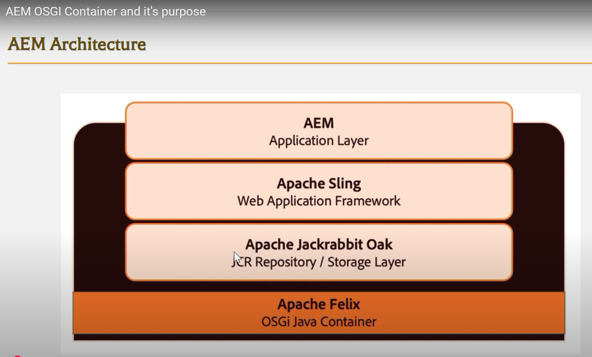
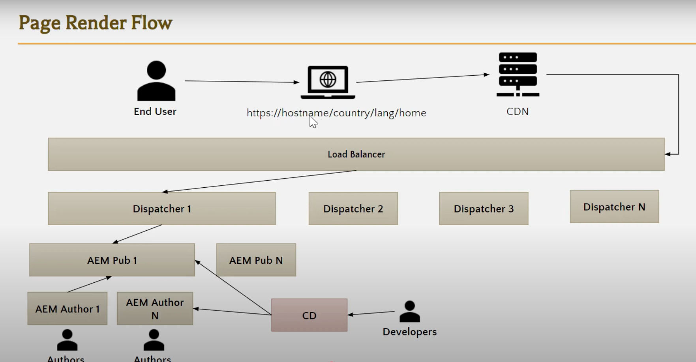

# Architecure

**1. Genreal Web Development Architecture:**
Client (user browser) > Web server > App server > Database

    a) If it's a static page (url.html), request gets served from Web server itself.
    b) If dynamic content is needed, then Web server sends request to App server and App servers provides the content.
    c) Java framewrok : Looks the URL that came from client. Also, Java and it's class etc are all stored in App server

**2. AEM Web Development Architecture:**
Client (user browser) > Web server (Dispatcher) > App server (Sling Framework) > Database (JCR)

    a) App Server : Apache Sling Framework is used. It's work is to check which JAVA class/code block to use, when this URL is called.
    b) JCR : No-SQL Database

    
    
    
    

