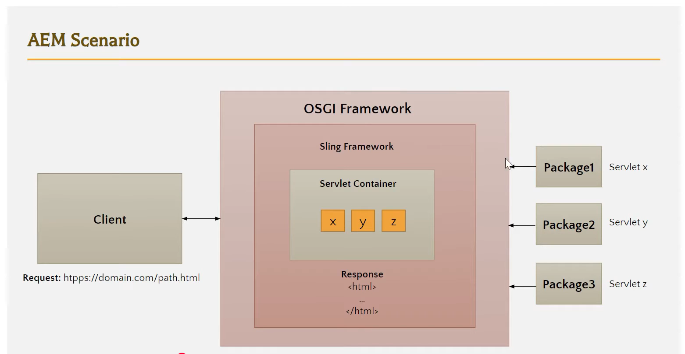
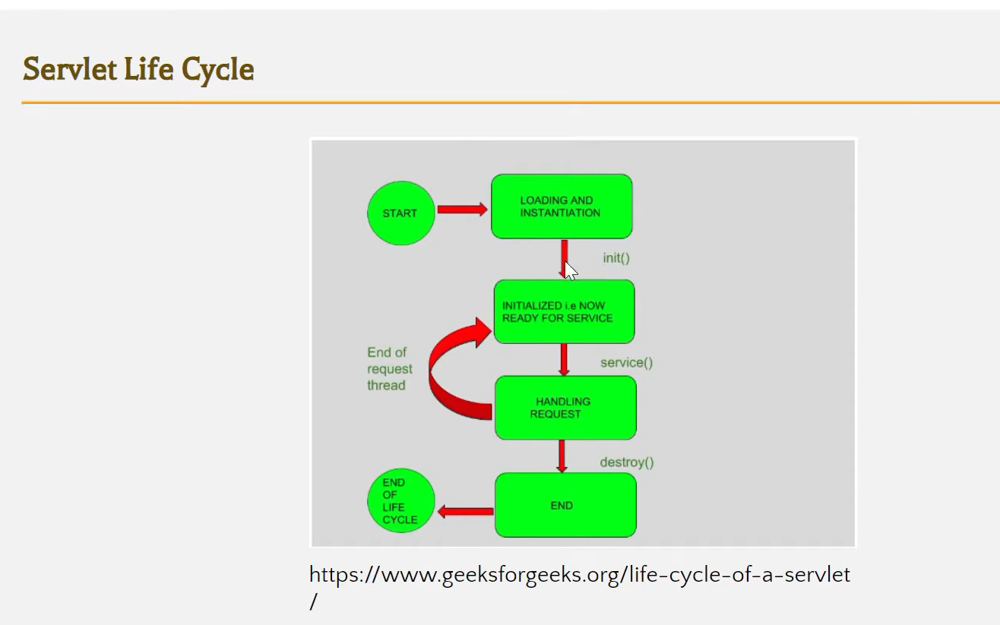

# AEM Servlet

<div style="display: flex; flex-wrap: wrap; gap: 16px; justify-content: space-between;">
    
    
</div><br>

1. AEM Servlet :

    > An AEM Servlet is a Java class used in AEM to handle HTTP requests & generate responses.
    > They handle HTTP requests (like GET, POST, PUT) from the client side and return data or perform server-side logic.

2. Purpose: Used to process backend logic (e.g., reading/writing data in JCR) and return data (JSON, HTML, etc.) to the client.
3. Registration Types:

    - Path-based: Mapped using @SlingServletPath
    - Resource type-based: Mapped using @SlingServletResourceTypes

4. Common Use Case:

    - Handling AJAX calls from the front end.
    - Handling form submissions
    - Serving JSON or XML to frontend components
    - Communicating with external APIs
    - Performing CRUD operations on the JCR repository

    > AJAX stands for Asynchronous JavaScript and XML — it's a technique used in web development to send & receive data from a server without refreshing the web page.

    > Simply, AJAX lets you update part of a web page without reloading the whole page.

    - AJAX is Not a programming language — it's a technique using:
        - JavaScript – to make requests
        - XMLHttpRequest or fetch() API – to talk to the server
        - JSON (instead of XML in modern apps) – to send/receive data
        - HTML/CSS – to update the UI dynamically

    Why Use AJAX?
    | Without AJAX | With AJAX |
    | ----------------------------------- | ----------------------------- |
    | Whole page reloads on every request | Only parts of the page update |
    | Slower, more load on server | Faster and smoother UX |
    | Breaks user flow | Keeps user in context |

5. How Servlet interacts with the frontend:

    - The frontend (HTL, JavaScript, React, etc.) makes a request (usually via AJAX/fetch/XHR) to a backend servlet endpoint (e.g., /bin/myapp/data).
    - The servlet processes the request and returns a response, often in JSON format.
    - The frontend consumes the data and updates the UI accordingly.

6. Example Use Case:

    - Frontend (JS code):

    ```
        fetch('/bin/myapp/userinfo')
        .then(response => response.json())
        .then(data => {
            console.log(data);
        });
    ```

    - Backend (AEM Servlet):

    ```
        @Component(service = Servlet.class,
           property = {
               "sling.servlet.paths=/bin/myapp/userinfo",
               "sling.servlet.methods=GET"
           })
        public class UserInfoServlet extends SlingAllMethodsServlet {
            @Override
            protected void doGet(SlingHttpServletRequest request, SlingHttpServletResponse response) throws IOException {
                response.setContentType("application/json");
                response.getWriter().write("{\"user\":\"admin\"}");
            }
        }
    ```
