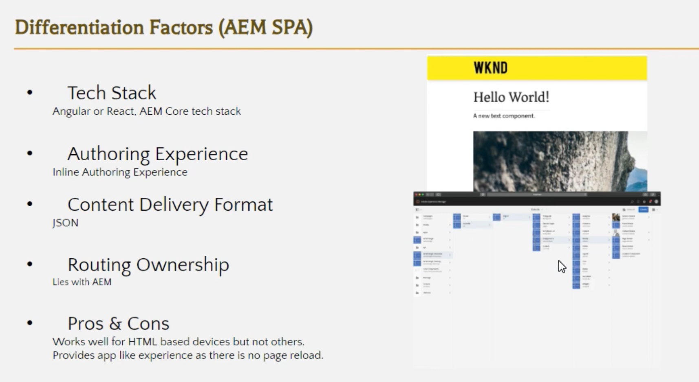
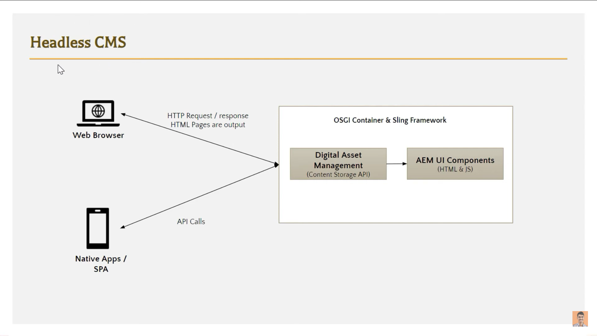
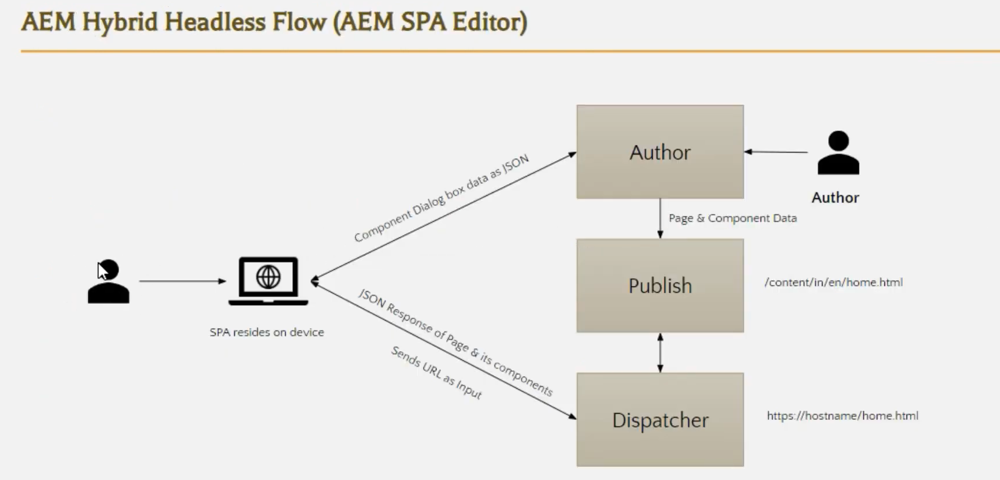
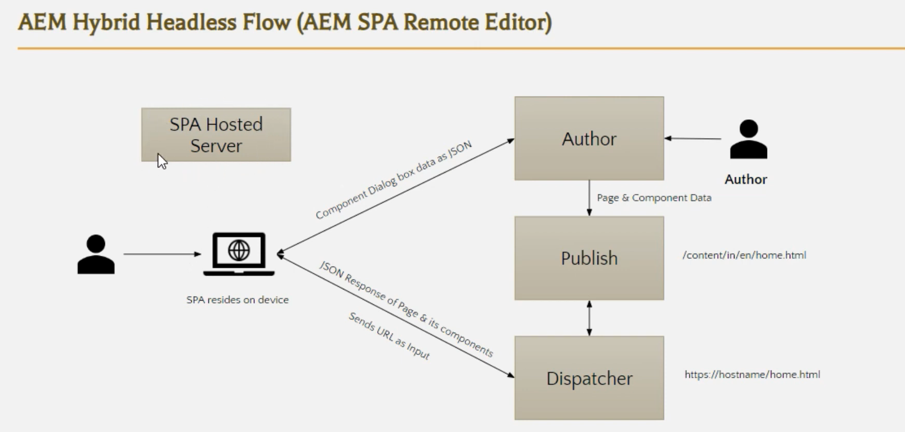
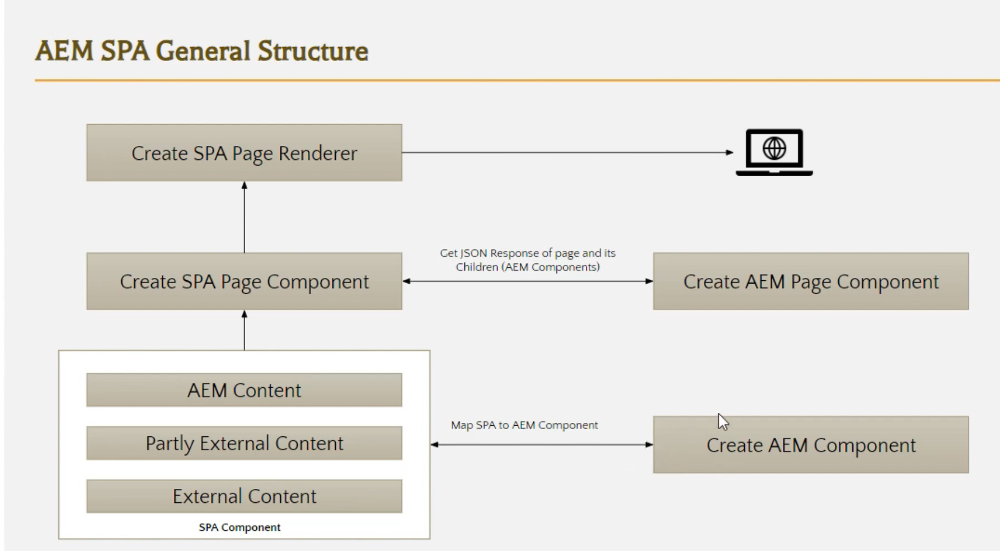

# AEM Headless Architecture

1.  CMS

    -   A Content Management System (CMS) is software that helps users create, manage & modify digital content on websites without needing to write code.
    -   Examples: WordPress, Drupal, AEM, Wix

     

2.  Headless CMS

    -   A Headless CMS separates the backend (content repository) from the frontend (presentation).
    -   It delivers content via APIs (usually REST or GraphQL), allowing flexibility to display content on any device—web, mobile, IoT, etc.

3.  OOTB Options in AEM
    | **Option** | **Description** |
    | -------------------------------- | ---------------------------------------------------- |
    | Traditional Page-based Authoring | Standard AEM authoring with templates/components |
    | Headless Content Delivery | JSON/GraphQL APIs to deliver structured content |
    | Content Fragments (CFs) | Reusable structured content, used in headless setups |
    | Experience Fragments (XFs) | Reusable content + layout, usable across channels |

4.  AEM as Headful (Traditional) vs Headless
    | **AEM as Headful CMS** | **AEM as Headless CMS** |
    | ---------------------------------------------------- | ---------------------------------------------------------------- |
    | AEM handles both content and frontend (presentation) | AEM delivers content only, using REST/GraphQL APIs |
    | Authors use templates/components to build web pages using WYSIWYG editor | Authors manage structured content (Content Fragments & Models) |
    | Good for websites where AEM controls the full frontend. | Good for web apps, mobile apps, kiosks, or multichannel delivery. This setup supports modern frontend frameworks and multichannel delivery—web, mobile apps, kiosks, etc |

5.  AEM SPA Editor vs Remote SPA (Single Page Application)
    | **AEM SPA Editor** | **AEM Remote SPA** |
    | ---------------------------------------------- | ------------------------------------------------------------------- |
    | Integrates SPAs (React/Angular) into AEM | SPA hosted externally (e.g., CDN), content pulled from AEM via APIs |
    | Allows in-context editing by authors. Allowing authors to edit SPAs visually. | Maintains content control in AEM, decouples hosting |
    | Useful when both devs and authors need control. It bridges developer-built frontends with AEM’s authoring tools. | Ideal for performance, scalability, and modern deployment setups |

6.  Factors to choose AEM Headless Options

    -   Project requirements (multichannel, app vs. website)
    -   Developer skills (React/Angular/Vue vs. AEM templating)
    -   Performance and caching needs
    -   Authoring experience preference (page editor vs. structured content)

    | **Factor**                | **When AEM Headless Is Chosen**                                              | **When AEM Headful Is Chosen**                                                    |
    | ------------------------- | ---------------------------------------------------------------------------- | --------------------------------------------------------------------------------- |
    | **Project Requirements**  | If content is delivered to multiple platforms (web, mobile, IoT, etc.)       | If content is for a traditional website only, managed fully within AEM            |
    | **Developer Stack**       | If frontend is built with React, Angular, Vue, or other JS frameworks        | If using HTL/Sling/AEM templating & no need for SPA frameworks                    |
    | **Performance & Caching** | If using CDNs, remote hosting, or need lightweight APIs for fast performance | If full rendering is handled within AEM and performance is tuned internally       |
    | **Authoring Preference**  | If authors can work with structured content (Content Fragments, models)      | If authors prefer WYSIWYG editing, page composition, and drag-and-drop components |

7.  Differentiation Factors: CMS Types
     
    | **Type** | **Description** |
    | ----------------------- | ------------------------------------------------------------------------------------------------------------------------------------------------------------------------------------------------------------------------------------------------------------------------------------------------------ |
    | **Headful CMS** | - Traditional CMS model where both **content** and **presentation (frontend)** are tightly coupled.  - Authors use **page editors**, templates, and components.  - Example: Adobe Experience Manager (AEM) in full-site mode, WordPress. |
    | **Hybrid Headless CMS** | - Combines features of both **headful and headless**.  - Backend can deliver content via **APIs** (REST/GraphQL), but still supports visual editing.  - Supports SPAs with **in-context editing** (e.g., AEM SPA Editor).  - Offers flexibility: deliver content to websites, apps, IoT, etc. |
    | **Pure Headless CMS** | - Backend-only CMS with **no presentation layer**.  - Content is managed and delivered solely through APIs.  - Fully decoupled; requires frontend devs to build all presentation layers.  - Example: Contentful, Strapi, Sanity. |

8.  Clients Prefer Hybrid Headless because:
    | **CMS Type** | **Adoption by AEM Clients** | **Why?** |
    | ------------------- | --------------------------- | --------------------------------------------------------------------------------------- |
    | **Headful CMS** | Still used, but declining | Familiar WYSIWYG editing, but less flexible for multichannel or app-based delivery |
    | **Hybrid Headless** | **Most commonly used** ✅ | Best of both worlds: structured content APIs + visual editing + SPA support |
    | **Pure Headless** | Niche, growing slowly | Full frontend control, but lacks native authoring experience — requires more dev effort |

            -   AEM Clients Prefer Hybrid Headless because:
                -   Want modern frontends (React, Angular)
                -   Still need author-friendly tools like AEM’s in-context editing
                -   Are delivering content to multiple channels (apps, web, kiosks)
            -   The SPA Editor and Content Fragments allow them to build APIs while retaining editorial control.

    

      
      
      
      
    
 

9.  Related Images

    -   Headless CMS
        

          
          
        
 

    -   Hybrid Headless Flow : SPA Editor vs SPA Remote Editor
        
 
        
        
        
 

    -   AEM SPA General Structure vs SPA Remote Structure
        

        
        
        

